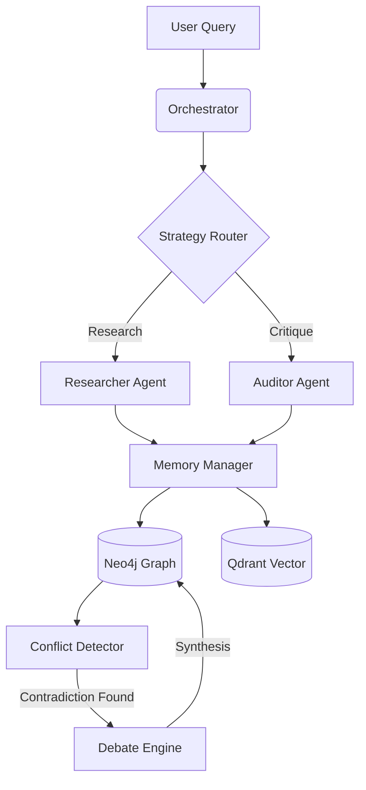

# 🧩 MOSAIC
### **Multi-agent Open-state Semantic Interaction & Consensus**

[](https://opensource.org/licenses/MIT)
[](https://www.python.org/downloads/)
[](https://neo4j.com/)
[](https://fastapi.tiangolo.com/)
[](https://langchain-ai.github.io/langgraph/)

> **MOSAIC** is a next-generation multi-agent framework designed to solve the problem of knowledge entropy and cognitive dissonance in AI systems. By treating contradictions as first-class relationships and using a structured dialectical protocol, MOSAIC builds a self-correcting, living memory graph.

---

## 🛠 Core Pillars

### 🧠 **Cognitive Memory Graph**
Unlike traditional RAG systems that treat documents as static chunks, MOSAIC maps knowledge into a **Neo4j property graph**. It uses **Qdrant** for high-dimensional vector awareness, allowing agents to navigate both semantic similarity and structural relationships.

### ⚖️ **Dialectical Debate Protocol**
Every claim added to the system is subjected to a structured debate. **Researchers**, **Critics**, and **Synthesizers** engage in a Pydantic-enforced protocol to verify, challenge, and refine information before it becomes part of the "ground truth."

### 🕰 **Temporal Decay Auditor**
Knowledge isn't eternal. The **Temporal Auditor** continuously monitors the graph, applying exponential decay to confidence scores. Stale information is automatically flagged for re-validation by local Llama-3 instances.

### 🎭 **Dynamic Orchestration**
Powered by **LangGraph**, the orchestrator runs a virtual machine for agents. It handles dynamic routing, state persistence across sessions, and real-time event streaming via WebSockets.

---

## 🏗 Architecture



---

## 🚀 Getting Started

### 📦 Installation

```bash
# Clone the repository
git clone https://github.com/your-username/mosaic.git
cd mosaic

# Setup environment
cp .env.example .env

# Bootstrap with Makefile
make setup
```

### 🐳 Infrastructure

MOSAIC requires Neo4j and Qdrant. Start them instantly using Docker Compose:

```bash
docker-compose up -d
```

### 💻 Running the System

Start the backend and CLI in tandem:

```bash
# Start FastAPI Server
uvicorn api.app.main:app --reload

# Launch the Interactive CLI
python -m cli.main run --query "Explain the impact of neuroplasticity on habit formation"
```

---

## 📊 Visual Intelligence

MOSAIC features a real-time dashboard for monitoring agent health and graph evolution.

- **Real-time Event Stream:** Listen to agent "thoughts" via WebSockets.
- **Cytoscape.js Integration:** Interactive 3D visualization of claim relationships.
- **Performance Benchmarks:** Latency and consensus tracking.

---

## 🛠 Tech Stack

- **Core:** Python 3.10, LangGraph, Pydantic v2
- **Database:** Neo4j (Graph), Qdrant (Vector)
- **API:** FastAPI, WebSockets
- **CLI:** Typer, Rich
- **LLMs:** Gemini (Reasoning), Llama-3 (Audit), GPT-4o (Synthesis)

---


<p align="center">
  Built with ❤️ for the future of Autonomous Intelligence.
</p>
